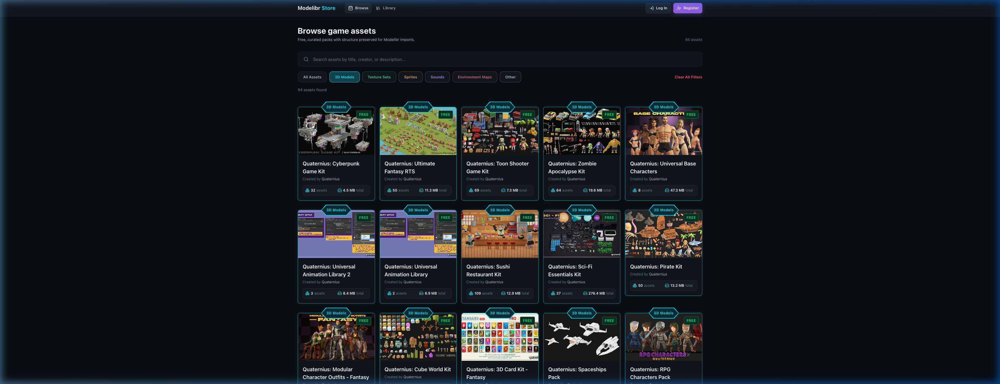

# CC0-Public-Domain-Sprites

A curated collection of **100% CC0 Public Domain 2D Sprites, Tilesets, Pixel Art, Characters, and UI Assets** for game developers, artists, and creators.

Every sprite in this repository is organized with verified provenance, clean transparency, and metadata tags ready for game engines and 2D toolchains.

[](https://store.modelibr.com)

---

## Live Catalog & One-Click Import

All sprite packs in this repository are indexed and hosted on **[store.modelibr.com](https://store.modelibr.com)**:

- **Interactive 2D Asset Browsing**: Preview individual sprites, animations, and tilesets directly in your browser.
- **One-Click Local Import**: Import packs and individual sprite sheets directly into your local **[Modelibr](https://github.com/Papyszoo/Modelibr)** desktop instance.
- **Standardized Sprite Taxonomy**: Categorized across 7 standardized sprite domains:
  - `Characters`, `Creatures`, `Tilesets & Environments`, `Items & Icons`, `UI`, `Effects`, `Backgrounds`

---

## Included Collections

| Creator / Collection | Description |
| :--- | :--- |
| **[Kenney](https://kenney.nl)** | Iconic 2D game asset kits (Platformers, Roguelikes, Top-Down Shooters, Pixel UI, Emotes, RPG Icons, Hex Tiles). |
| **Community Pixel Art & Vectors** | Verified CC0 characters, dungeon tilesets, particle effects, and pixel monsters. |

---

## Repository Layout

Every sprite pack is completely self-contained in its own directory:

```text
packs/
  <pack-slug>/
    pack.json              # Authored metadata (name, creator, website, license, description)
    cover.png              # Pack cover art / catalog listing thumbnail (optional/original author)
    store-manifest.json    # Self-contained store manifest pinned to Git commit
    sprites/               # 2D Sprite images / tilesets (.png, .webp, .svg, .gif, .jpg, etc.)
scripts/
  generate-store-manifest.mjs   # Generates per-pack store-manifest.json
```

---

## License

All assets in this repository are dedicated to the public domain under the **[Creative Commons Zero 1.0 Universal (CC0 1.0)](https://creativecommons.org/publicdomain/zero/1.0/)** license. You may freely use, modify, distribute, and monetize these assets in personal and commercial projects without attribution.
